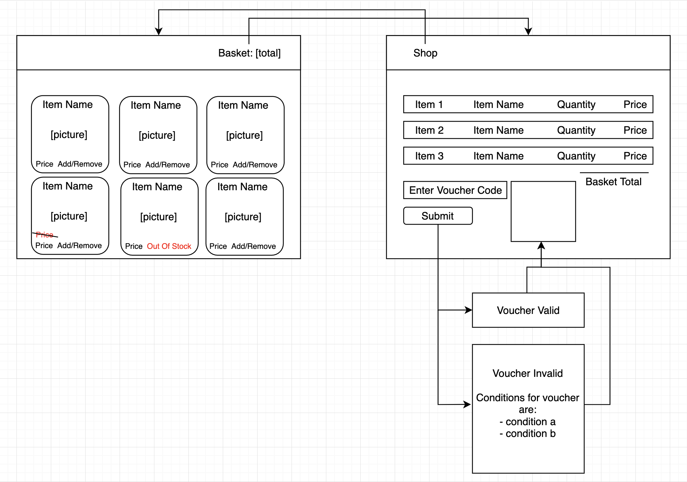

# Clothing Retailer Website 
##### A Tech Test

## Specification

#### User Stories

These user stories are ordered according to priority, implement each feature starting from the top.

```
As a User
I can add a product to my shopping cart.

As a User
I can remove a product from my shopping cart.

As a User
I can view the total price for the products in my shopping cart.

As a User
I can apply a voucher to my shopping cart.

As a User
I can view the total price for the products in my shopping cart with discounts applied.

As a User
I am alerted when I apply an invalid voucher to my shopping cart.

As a User
I am unable to add Out of Stock products to the shopping cart.
```

#### Product List

|Product Name | Category | Price | Quantity in Stock |
|-------------|----------|-------|-------------------|
|Almond Toe Court Shoes, Patent Black|Women’s Footwear|£99.00|5|
|Suede Shoes, Blue|Women’s Footwear|£42.00|4|
|Leather Driver Saddle Loafers, Tan|Men’s Footwear|£34.00|1|2
|Flip Flops, Red|Men’s Footwear|£19.00|6|
|Flip Flops, Blue|Men’s Footwear|£19.00|0|
|Gold Button Cardigan, Black|Women’s Casualwear|£167.00|6|
|Cotton Shorts, Medium Red|Women’s Casualwear|£30.00|5|
|Fine Stripe Short Sleeve Shirt, Grey|Men’s Casualwear|£49.99|9|
|Fine Stripe Short Sleeve Shirt, Green|Men’s Casualwear|~~£49.99~~ £39.99| 3|
|Sharkskin Waistcoat, Charcoal|Men’s Formalwear|£75.00|2|
|Lightweight Patch Pocket Blazer, Deer|Men’s Formalwear|£175.50|1|
|Bird Print Dress, Black|Women’s Formalwear|£270.00|10|
|Mid Twist Cut­Out Dress, Pink|Women’s Formalwear|£540.00|5|

The product list will be stored in a local file rather than in a database.

#### Discounts

Given that one of the products on the list has been discounted by £10.00 I will assume that individual items can be temporarily discounted. 

Discounts vouchers can be redeemed, the following offers are available:
 - £5.00 off your order
 - £10.00 off orders over £50.00
 - £15.00 off orders over £75.00 and including footwear

I have assumed that the user is not allowed to combine discount vouchers.

Discount vouchers will be applied when viewing the basket, codes will be entered into a box and the site will alert the user as to whether or not the conditions for the voucher have been met. Voucher discounts, along with item discounts, will be stored in a local file alongside the products. 

## Site Mockups

The main page of the site will display all products, on a realistic site the main page would likely display information about the company and its products along with a dropdown menu with links to each category of product. I would prefer to implement a database and create models for items, colours and discounts before doing that.



## Stack

Node.js and Express

Testing with Jest

Packages:
 - [Dotenv](https://github.com/motdotla/dotenv): Loads environment variables for Node
 - [Pug](https://github.com/pugjs/pug) (formerly Jade): html template engine for Node
 - [Session](https://github.com/expressjs/session): Session middleware for Express

## Running

Make sure you have [node.js](https://nodejs.org/en/) and npm installed. Npm comes with node but if you haven't updated it in a while you can do so with the command `npm install npm@latest -g`

Move into the directory and run `npm install` to set up the environment.